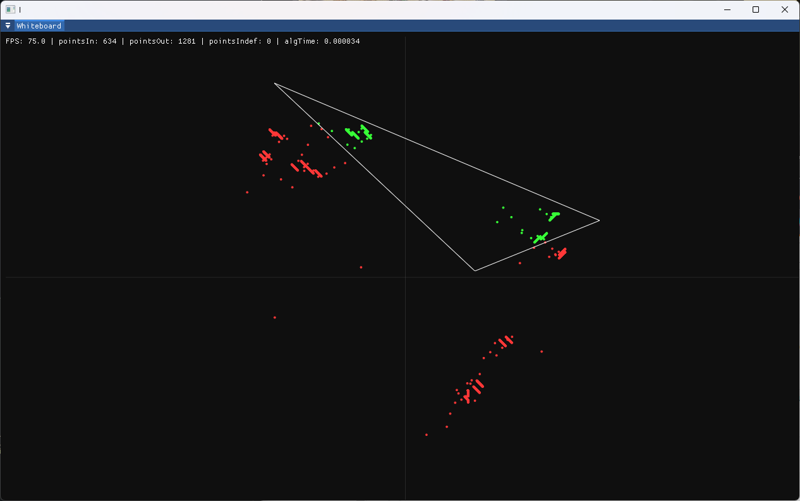

# PNPolyVizualization

This program is simple vizualization of solution for Point-In-Polygon (PIP) problem.

## Installation

Clone the repo with submodules:

```
git clone https://github.com/Kseen715/PNPolyVizualization.git --recurse-submodules
```

CD in directory:

```
cd PNPolyVizualization
```

Compile useing `make`:

```
make -B
```

Launch:

```
./build/pnp.exe
```

## Screenshots


